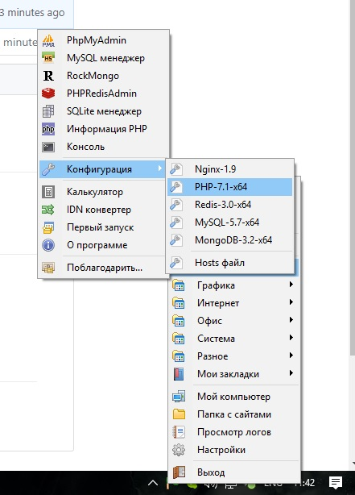
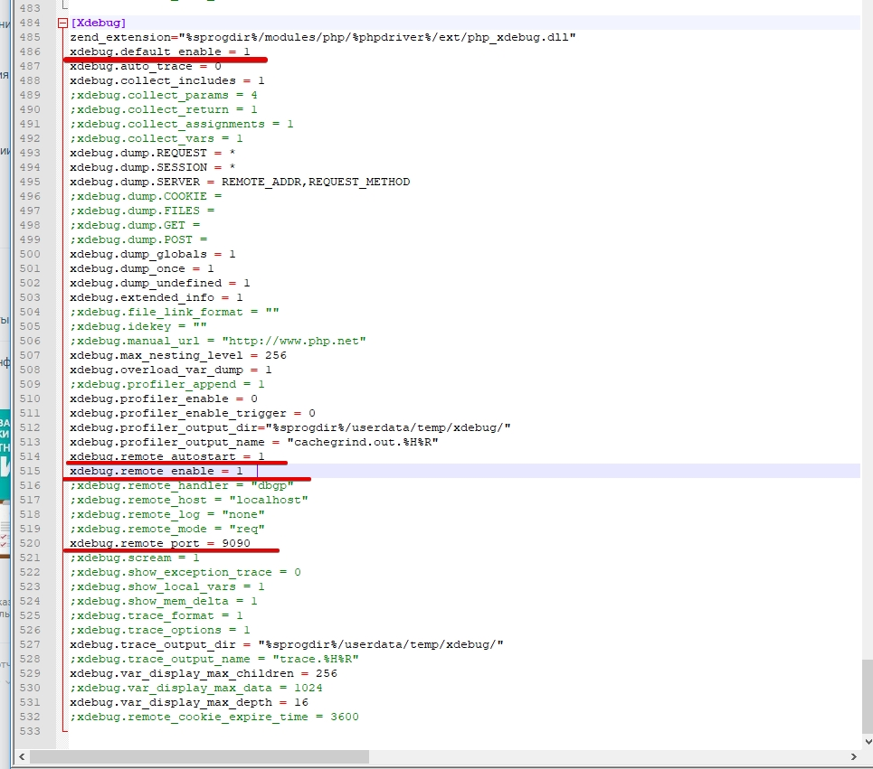
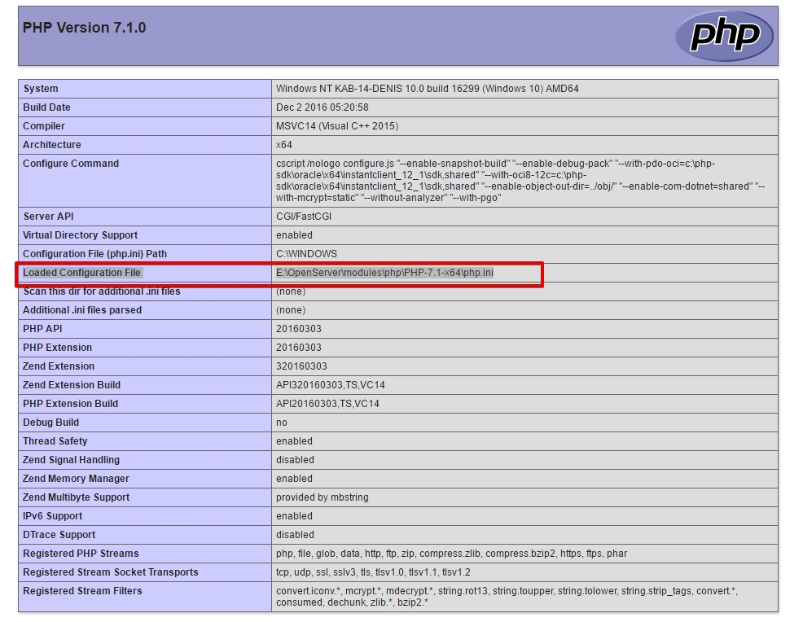
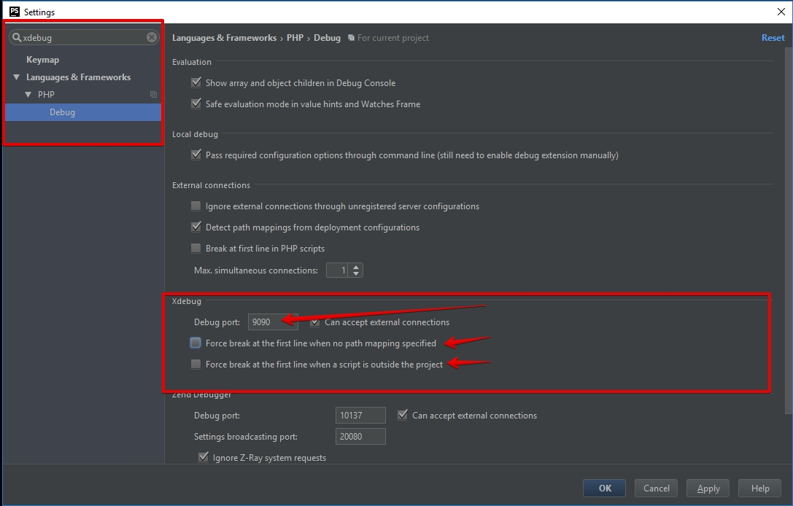
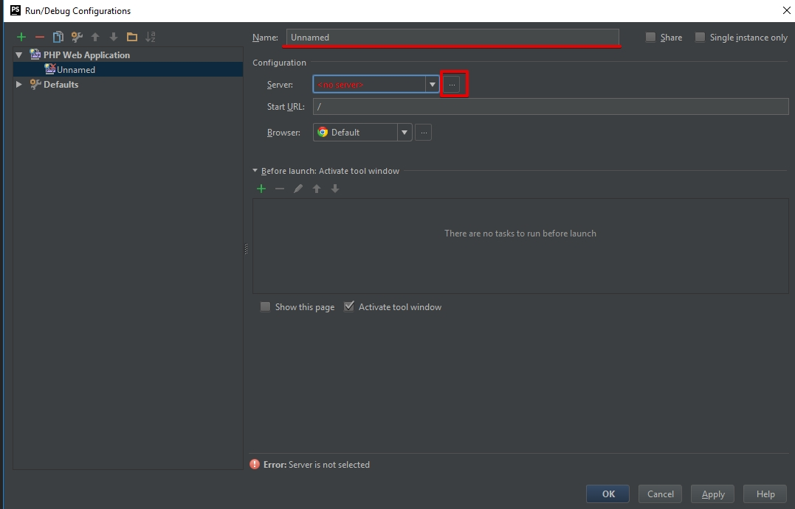
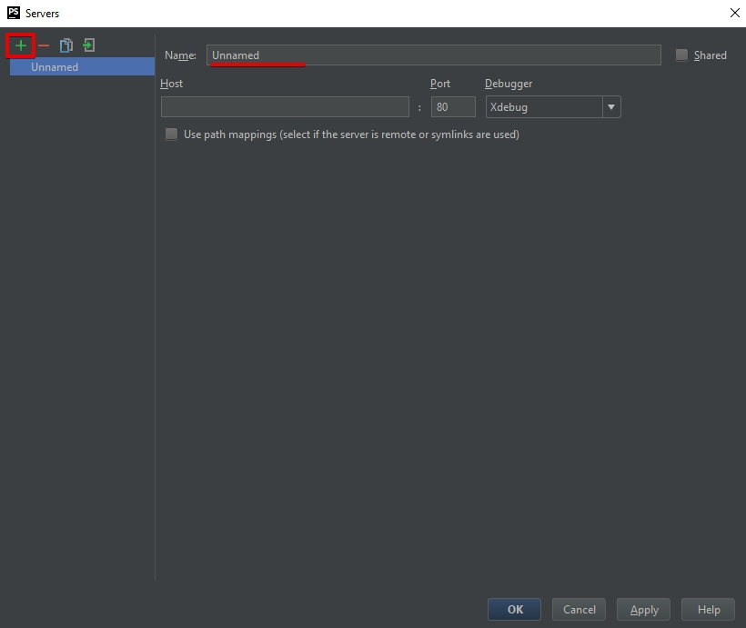
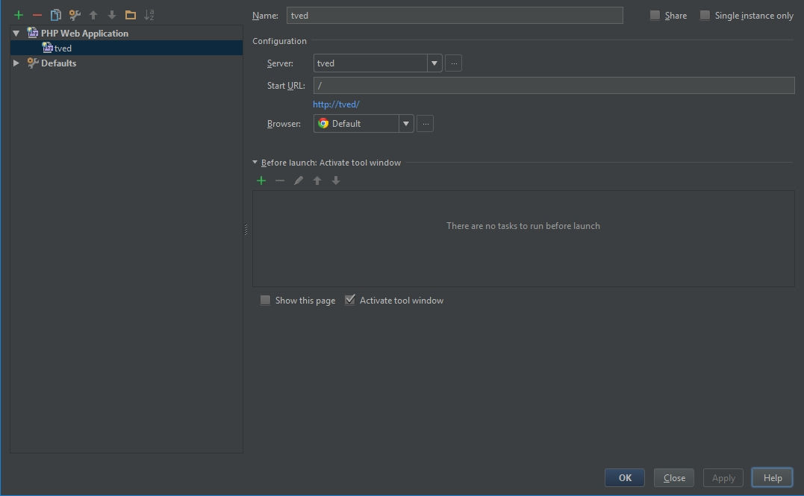
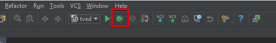
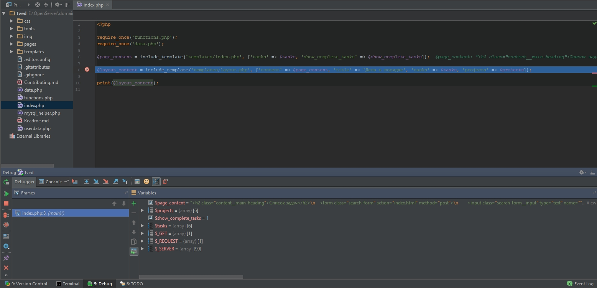

# Как настроить дебаг систему в PhpStorm и упростить себе жизнь.

## Введение

Данное руководство предназначено для зеленых новичков, которые только начинают
изучать мир PHP и могут столкнуться с тяготами отладки кода.

Если вы уже более опытный пользователь, возможно вам будет достаточно [официальных материалов](https://www.jetbrains.com/help/phpstorm/configuring-xdebug.html)
или немного устаревшей [инструкцией с хабра](https://habrahabr.ru/post/250323/)

**Убедитесь, что OpenServer установлен в корень диска**

## Включение модуля XDEBUG для PHP в OpenServer

1. Для начала необходимо включить сам модуль дебаггинга. Для этого нужно
перейти в конфигурацию:

**OpenServer -> Дополнительно -> Конфигурация -> PHP-ваша версия**

2. Файл конфигурации достаточно большой, поэтому воспользуемся поиском. Нажав **CTRL+F** введите в поиске **[Xdebug]**.
Должно открыться что-то подобное:

Красным выделены необходимые к изменению параметры. Убедитесь, что они раскомментированы (отсутствие ; в начале строки) и соответствуют указанным значениям.
Обратите внимание на строку **xdebug.remote_port** - эти цифры нужно запомнить для дальнейшего подключения к дебаггеру. Мы будем использовать именно их.

3. Сохраняем файл и перезагружаем сервер.

## Что если у вас не OpenServer?

Если вы используете что-то другое или чистый PHP, вам необходимо самостоятельно найти конфигурационный файл PHP и изменить его.
Самый простой способ поиска, это добавить в `index.php`, в самом начале строку: `<?php phpinfo(); ?>`. 

Теперь открыв index.php в браузере вы увидите подобную картинку:

Красным выделена строка с путем до конфигурационного файла. Открываем его и вносим изменения из 2 шага предыдущей главы.

## Непосредственная настройка PHPStorm

### Подключаем PHPStorm к Xdebug

Xdebug настроен. Осталось только подключиться к нему.

1. Заходим в настройки: **File -> Settings**.
2. В поиске вводим: **xdebug**.
3. Должна получиться такая картинка:

4. В поле **Debug port** вводим запомненные ранее цифры. Если вы указывали тоже что и я, то это будет **9090**.
5. Убираем галочки в пунктах **Force break**. Они отмечены на скриншоте выше стрелками.
6. Сохраняем.

### Создаем отладочную конфигурацию

Теперь необходимо создать отладочную конфигурацию. Это последний этап настройки.
1. Открываем панель отладки: **Run -> Edit configurations**
2. Должно открыться вот такое окно:

3. Нужно нажать на зеленый плюс и выбрать  **PHP Web Page** (В старых версиях PHP Web Application)

4. Для начала нужно придумать имя вашему приложению. Имя может быть любым.
5. К сожалению, у нас еще нет связи с сервером, на котором работает приложение. Для этого необходимо нажать на многоточие
справа от селектора сервера. На скриншоте данная кнопка выделена красным прямоугольником.

Это окно очень похоже на предыдущее. Давайте добавим сервер.

6. Нажимаем на зеленый плюс и вводим имя сервера в поле **Name**. Имя также может быть любым.
7. **Важный шаг.**

В поле **Host** необходимо ввести адрес, по которому у вас открывается ваш сайт. Это то, что вы пишете в адресной строке, чтобы открыть результаты вашего кода. 

**Адрес пишется без / на конце и без протокола!**

Например: **localhost**, **doingsdone**, **yeticave**.

8. Если вы, когда открываете сайт в браузере еще и указываете порт, например, **localhost:8080**, то вам также необходимо изменить цифры в поле **Port**, на те, которые вы указываете в адресе после двоеточия.

9. Когда все заполнено, нажимаем **Ок**.
10. Выбираем только что созданный сервер.

Должно получиться как-то так:

11. Вы можете проверить работоспособность сервера, нажав на сгенерированную ссылку под полем **Start URL**. Должен открыться ваш проект.

**Убедитесь что вы не забыли запустить OpenServer или Web server перед этим**

12. Если все хорошо, нажимаем **Ок**. На этом настройка закончена. Можно пользоваться!

## Использование отладчика.

Настроить это хорошо, но нужно еще и научиться им пользоваться!

1. Для включения режима отслеживания, необходимо нажать на кнопку жука на панели управления.

2. После нажатия должна автоматически открыться страница с вашим проектом в браузере.

Отладчик включен, можно пользоваться!

Для приостановки программы в нужном месте, вам необходимо установить **breakpoint** в нужной строке кода. Обратите внимание, что между цифрами нумерации строк и непосредственно кодом, есть небольшой участок пустого места. Вот если вы ткнете туда мышкой, там появится красная точка. Это и есть **breakpoint - точка остановки программы**. Если после установки этой точки, перезагрузить страницу с этим скриптом, то вы увидите, что страница не грузится, а фокус перешел в окно PHPStormа. Программа остановилась **ДО** выполнения этой строчки кода, а внизу появилась панель отладки с различной информацией.

В редакторе подсвечена строка, на которой остановилась программа, а внизу указаны все данные на данном этапе. 

Слева в отладочном окне расположена колонка иконок. 
* Чтобы продолжить работу, нужно нажать на зеленую стрелку кнопку вида *Play*. 
* Чтобы отключить дебаггер полностью, нужно нажать на красный квадрат вида *Stop*

Остальные иконки позволяют перемещаться между брейкпоинтами. Вы можете ставить несколько брейкпоинтов подряд и смотреть как изменяются данные в переменных. Например, при обработке массива.

### Важное замечание
**Чтобы точки остановки работали, они обязательно должны быть установлены на строке с кодом. Иногда для этого можно добавить отладочную запись `echo 1`, к примеру. Данная строка никак не повлияет на код, но вызовет точку остановки в данной строке.**

## Заключение

Вот в общем-то и весь процесс настройки. Настройка в первый раз занимает полчаса, но экономит огромное количество времени в дальнейшей отладке. Вам больше не придется мучиться с поиском ошибок, выводя массивы через `var_dump()` :)

Будет здорово, если вам есть чем дополнить материал и вы поделитесь этим.
